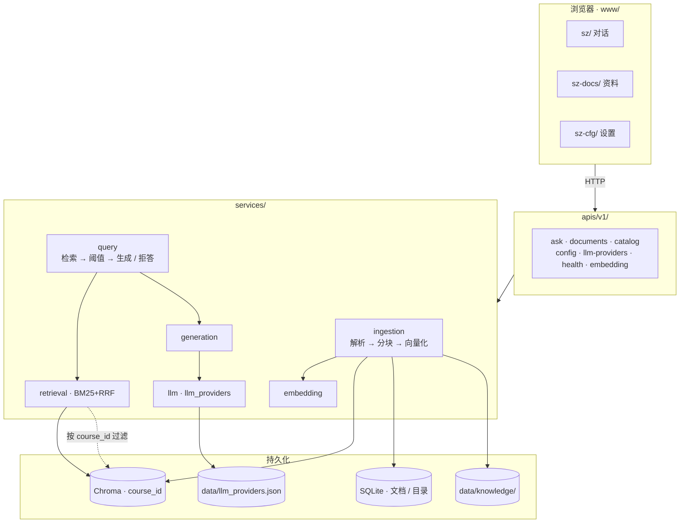
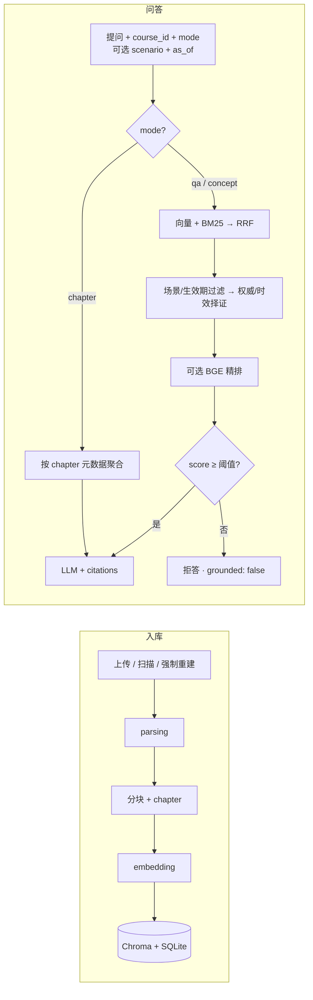

<div align="center">

# 溯知

### exam-rag · 据源而答 · 出处可循

把讲义、笔记、真题放进本机资料库，用自然语言提问。  
答案必须落到具体片段；检索不够就拒答，不硬编。

[](https://www.python.org/)
[](https://fastapi.tiangolo.com/)
[](https://www.trychroma.com/)
[](https://docs.astral.sh/uv/)

</div>

## 它做什么

本地跑起来的课程资料问答：入库 → 按课隔离检索 → 带引用作答。前端在 `www/`（手写 HTML/CSS/JS，无构建），后端是 FastAPI + Chroma + SQLite。

**使用边界：**默认仅监听 `127.0.0.1`。目前没有用户登录或访问鉴权，`course_id` 只用于课程数据隔离；请勿直接暴露到公网或不可信网络。配置远程 LLM / Embedding / 视觉服务后，相应问题、检索片段、待向量化文本或图片会发送给你选择的服务商；使用前确认资料允许这样处理。

| 能力 | 说明 |
|:-----|:-----|
| 自由问答 | `mode=qa`，混合检索（向量 + BM25 → RRF；可选 BGE 精排） |
| 知识点 | `mode=concept`，更大 top_k，按「定义 → 公式 → 例题」聚合 |
| 章节概览 | `mode=chapter`，按 `chapter` 元数据聚合（不走语义检索） |
| 拒答 | 最高分低于阈值 → `grounded: false`，固定文案，禁止无引用硬编 |
| 多课隔离 | 一切检索 / 上传 / 删除都带 `course_id` |
| 资料格式 | PDF · TXT · MD · DOC · DOCX · PPTX；PDF 支持质量评估、MinerU 高精度重试、可选外部增强与 OCR 回退 |
| PDF 自动更新 | 哈希去重 + 文件名/内容匹配；新版影子入库成功后再切换 |
| 证据治理 | 自动抽取版本/生效期/权威候选；人工固定场景后按场景、时效、权威筛选并解释引用 |
| 意图路由 | 三层漏斗：规则直达 → 会话状态继承 → 受约束 LLM 兜底；不会将全部请求交给模型 |

## Quick Start

需要 Python 3.11–3.13（默认 3.11）和 [uv](https://docs.astral.sh/uv/)。进入下载并解压后的项目根目录，再执行下面的命令。启动页面不需要 API Key；生成答案前需配置 OpenAI 兼容的对话 API。PDF 默认尝试可选的 MinerU，不可用时回退到内置 PyMuPDF；扫描版 PDF 的 OCR 需安装 [Tesseract](https://github.com/tesseract-ocr/tesseract) 及 `eng` / `chi_sim` 语言包。旧版 `.doc` 需 [LibreOffice](https://www.libreoffice.org/) 或 Windows 本机 Microsoft Word。

当前锁文件的主要目标平台为 Windows x64、Linux x64（glibc ≥ 2.28）和 Apple Silicon macOS ≥ 14。旧 macOS、Intel Mac、32 位系统及其他架构不保证可直接使用此锁文件；需另行选择兼容的 Torch 和依赖版本。已实测 Windows Python 3.11 的全新 CPU 安装、启动与单元测试；Linux/macOS 仅检查了依赖安装计划，尚未在这些系统上执行运行测试。

```bash
uv sync --locked       # 仅首次安装或主动更新环境时执行
uv run --no-sync exam  # → http://127.0.0.1:8787
```

首次启动会在 `.env` 不存在时从模板创建，不会覆盖已有 `.env`。在设置页注册并选择 LLM；本地 Embedding 首次使用需联网下载模型，也可将 `EMBEDDING_MODEL` 设置为已下载的模型目录。无网络且无模型缓存时，需先提供本地模型或配置远程 Embedding API。

Windows 已有 `.venv` 时可直接执行 `./start.ps1`。它只调用现有 Python，不安装、卸载或同步任何依赖。也可在 PowerShell 中运行 `& .\.venv\Scripts\python.exe -m src.main`。

### CPU / GPU 与已有环境

`EMBEDDING_DEVICE=auto`、`RERANK_DEVICE=auto` 会按当前 Torch 运行时选择 CUDA、Apple MPS 或 CPU；未安装 GPU 版 Torch、驱动不可用或指定 GPU 编号不存在时回退 CPU。GPU 模型加载或推理发生显存不足等运行时错误时，会在 CPU 上重试一次。日志会记录设备选择与回退原因；下载失败仍需修复网络或模型路径。

可在 `.env` 分别指定 `cpu`、`cuda`、`cuda:0` 或 `mps`，修改后重启。设备切换保持模型不变，不要求重建向量库。**修改 `EMBEDDING_MODEL` 则应重新入库**，不同模型的向量不可混用。

默认依赖使用 PyPI，不再强制 Windows CUDA 安装源，也不依赖相邻目录。需要 GPU 的新用户应先按 [PyTorch 官方安装选择器](https://pytorch.org/get-started/locally/) 匹配系统与驱动安装对应构建。程序检测设备不会自动下载或更换 Torch。

**已经安装 GPU Torch / Paddle 或本地 MarkPDFdown 的用户：日常使用 `uv run --no-sync exam` 或 `./start.ps1`。不要为启动服务再执行 `uv sync` 或普通 `uv run exam`，它们可能按发布依赖锁替换定制包，并移除未声明的本地包。** 需要尝试发布版安装时另建目录/虚拟环境。有关同步行为见 [uv 官方说明](https://docs.astral.sh/uv/concepts/projects/sync/)。

### 可选 PDF 增强

基础安装不包含 PaddleOCR、PaddlePaddle、MinerU 和 MarkPDFdown；未启用这些工具时可直接使用基础文本解析。

- **公式识别（CPU）**：在新环境执行 `uv sync --locked --extra formula`，再设 `FORMULA_RECOGNITION_ENABLED=true`。该 extra 安装 CPU Paddle。已有 Paddle GPU 环境不要同步这个 extra；继续使用现有安装并用 `--no-sync` 启动。
- **公式识别设备**：`FORMULA_RECOGNITION_DEVICE=auto` 按 Paddle 自身能力选择 GPU / CPU，也可指定 `cpu`、`gpu`、`gpu:0`。Torch 能使用 GPU 不代表 Paddle 也能；Windows 自动/GPU 路径在独立进程执行，隔离两套 CUDA/cuDNN。Paddle GPU 安装参照 [PaddlePaddle 官方说明](https://www.paddlepaddle.org.cn/install/quick)。
- **MarkPDFdown**：按 [官方仓库](https://github.com/MarkPDFdown/markpdfdown) 单独安装并配置多模态凭据，将命令放入 PATH 或填写 `MARKPDFDOWN_CMD` 绝对路径；主项目无需 `../MarkPDFdown`。启用参数见下文。
- **MinerU / OCR / DOC 转换**：需按各工具要求单独安装。缺少增强解析器时仍会尝试内置回退；纯扫描件若没有可用 OCR 工具，无法保证提取正文。

| 地址 | 用途 |
|:-----|:-----|
| [`/sz/`](http://127.0.0.1:8787/sz/) | 对话（自由问答 / 知识点 / 章节概览） |
| [`/sz-docs/`](http://127.0.0.1:8787/sz-docs/) | 资料上传 / 扫描（可选强制重建） |
| [`/sz-cfg/`](http://127.0.0.1:8787/sz-cfg/) | 设置（LLM、检索与 BGE 精排、OCR…） |
| [`/docs`](http://127.0.0.1:8787/docs) | OpenAPI |
| [`/api/v1/health`](http://127.0.0.1:8787/api/v1/health) | 健康检查 |

启动时会校验配置；资料入库请在资料页手动上传或扫描（启动不再自动扫库）。

## Commands

| 命令 | 说明 |
|:-----|:-----|
| `uv sync --locked` | 首次安装基础依赖（会同步环境） |
| `uv run --no-sync exam` | 使用已有环境启动服务（默认 `8787`） |
| `DEBUG=true uv run --no-sync exam` | Bash 调试模式；PowerShell 请设置 `$env:DEBUG='true'` |
| `uv run --no-sync pytest -q` | 单元测试，隔离配置与存储 |
| `uv run --no-sync pytest -q -m integration` | 集成测试；通过进程环境变量显式提供 Embedding / LLM 配置 |
| `uv run --no-sync python -m tests.eval.run_retrieval_eval --chroma ./storage/chroma` | 离线 Recall@K / MRR |
| `uv add <package>` | 添加依赖 |

```bash
curl http://127.0.0.1:8787/api/v1/health
```

## Architecture

浏览器只调 `/api/v1/*`；RAG 在 `services/`，不进 UI。





| 模块 | 职责 |
|:-----|:-----|
| `ingestion` / `parsing` | 解析分块入库；PDF 支持 MinerU 结构还原、语义切片、可选视觉摘要与 OCR 回退 |
| `retrieval` / `rerank` | 向量 + BM25 → RRF；按场景/生效期过滤，再按权威/时效择证；可选 BGE CrossEncoder 精排 |
| `query` / `intent` / `generation` | 三层意图路由与 `qa` / `concept` / `chapter` 编排、prompt |
| `eval_metrics` | 离线 Recall@K / MRR |
| `embedding` / `llm` | 本地或 OpenAI 兼容 API |
| `storage/` | Chroma 向量 · SQLite 元数据与目录 |

细节见 [docs/02-模块架构.md](docs/02-模块架构.md)。

<details>
<summary>目录结构</summary>

```
exam-rag/
├── data/                    # 运行时（gitignore）：knowledge、llm_providers.json
├── storage/                 # 运行时（gitignore）：Chroma · meta.db · 日志
├── src/
│   ├── main.py              # FastAPI · 挂载 www/
│   ├── apis/v1/
│   └── services/
├── www/                     # 前端源码（入库）
│   ├── shared/
│   ├── sz/
│   ├── sz-docs/
│   └── sz-cfg/
├── docs/
└── tests/
```

</details>

## Configuration

优先级：**环境变量 > `.env` > 代码默认值**。复制 `.env.example`，或在 `/sz-cfg/` 改。

| 分组 | 关键变量 |
|:-----|:---------|
| LLM | `LLM_PROVIDER` · `LLM_API_KEY` · `LLM_BASE_URL` · `LLM_MODEL` |
| Embedding | `EMBEDDING_PROVIDER`（`local` / `openai`）· `EMBEDDING_MODEL` · `EMBEDDING_DEVICE` |
| 精排设备 | `RERANK_DEVICE`（`auto` / `cpu` / `cuda` / `cuda:N` / `mps`） |
| 存储 | `CHROMA_PATH` · `SQLITE_PATH` · `KNOWLEDGE_DIR` · `PARSED_ASSETS_DIR` · `MAX_UPLOAD_MB` |
| PDF | `PDF_PARSER` · `MINERU_*` · `PDF_QUALITY_THRESHOLD` · `MARKPDFDOWN_*` · `PDF_USE_OCR` · `PDF_FORCE_OCR` · `PDF_OCR_LANGUAGE` |
| 视觉摘要（可选） | `VISUAL_MODEL` · `VISUAL_BASE_URL` · `VISUAL_API_KEY` · `VISUAL_TIMEOUT` |
| 代理 | `PROXY_URL` · `PROXY_ENABLED` · `NO_PROXY` |

可注册多个 LLM（OpenAI 兼容 / Ollama），「设为当前」后会写回 `.env`。

<details>
<summary>PDF 高精度解析与 MarkPDFdown 适配</summary>

默认链路为 MinerU `hybrid-engine` + `medium`，保留标题、表格、公式和图片结构。系统为每个候选结果计算 0～1 的质量分数（文本密度、页覆盖率、结构还原）；低于 `PDF_QUALITY_THRESHOLD` 时，会在 `MINERU_RETRY_HIGH=true` 下以 `--effort high` 重跑，并仅在结果更好时替换。随后仍会保留 PyMuPDF、OCR、Fitz 回退链，避免单个工具异常导致资料无法入库。

`MARKPDFDOWN_ENABLED=false` 是默认安全状态。已核验 MarkPDFdown 1.1.2 的文件模式为 `markpdfdown --input <PDF> --output <Markdown 文件>`；启用时可设置 `MARKPDFDOWN_CMD=markpdfdown` 和 `MARKPDFDOWN_ARGS=--input "{input}" --output "{output_file}"`。适配器也支持目录型 CLI 的 `{output}` 占位符；`{input}` 为 PDF 绝对路径，`{output_file}` 为临时 Markdown 文件。MarkPDFdown 需可用的多模态模型和 LiteLLM 凭据；无有效输出时自动回退内置链路。

当前环境若未安装 Tesseract，PyMuPDF 的扫描件 OCR 后备无法实际运行；此时优先使用 MinerU 的 `high`，或安装 Tesseract 及 `eng`、`chi_sim` 语言包后再启用 OCR 回退。

对于手写批注、公式与截图型讲义，解析结果会将 **PDF 物理页**、PDF 自定义页签和识别出的教材引用（如 `P28 Ex2`）分开写入 metadata；“考点/注意”等批注单独保留为可检索证据，页眉页脚、手机状态栏、邮箱/网址等明确噪声不入库。MinerU / MarkPDFdown 导出的图片会复制到 `PARSED_ASSETS_DIR`，因此配置视觉模型后，入库时可实际读取这些裁剪图生成摘要，而不是引用已清理的临时文件。公式兼容 `latex`、`math_content` 和 `equation` 等字段，统一保存为 LaTeX 分隔格式。

</details>

<details>
<summary>检索与分块</summary>

| 参数 | 默认 | 含义 |
|:-----|:-----|:-----|
| `top_k` | 5 | RRF 融合后保留条数；`concept` 默认更大 |
| `score_threshold` | 0.25 | 低于此分拒答；精排开启时作用于 sigmoid(logit) |
| `RERANK_ENABLED` | false | 是否启用 BGE CrossEncoder 精排 |
| `RERANK_MODEL` | `BAAI/bge-reranker-v2-m3` | 精排模型（sentence-transformers） |
| `RERANK_CANDIDATES` | 20 | 精排前候选池大小 |
| `RERANK_TOP_N` | 0（=top_k） | 精排后保留条数 |
| `chunk_size` | 800 | 分块字符数 |
| `chunk_overlap` | 50 | 相邻块重叠 |

</details>

## API

统一：`{ "code": 200, "data": … }` 或 `{ "code": 4xx, "message": "…" }`。完整契约见 [`/docs`](http://127.0.0.1:8787/docs)。

| 方法 | 路径 | 说明 |
|:----:|:-----|:-----|
| `GET` | `/api/v1/health` | 连通性 |
| `GET` / `PATCH` | `/api/v1/config` | 配置 |
| `GET` / `POST` | `/api/v1/llm-providers` | 列出 / 注册模型 |
| `POST` | `/api/v1/llm-providers/active` | 切换当前模型 |
| `DELETE` | `/api/v1/llm-providers/{name}` | 删除注册项 |
| `POST` | `/api/v1/embedding/warmup` | 后台拉取/加载本地模型或探测远程 API |
| `GET` | `/api/v1/embedding/status` | Embedding 就绪状态与拉取进度（`warmup.percent`） |
| `GET` | `/api/v1/colleges` | 学院 |
| `GET` | `/api/v1/courses` | 课程（可选 `?college_id=`） |
| `POST` | `/api/v1/documents` | 上传（Form 必填 `course_id`） |
| `GET` | `/api/v1/documents` | 列表（`?course_id=`） |
| `GET` | `/api/v1/documents/summary` | 资料分类概览（`?course_id=&by=type\|chapter`，默认 `type`） |
| `POST` | `/api/v1/documents/scan` | 扫描 knowledge（Form：`course_id`；PDF 自动识别更新；`force=true` 强制重新解析） |
| `PATCH` | `/api/v1/documents/{doc_id}/evidence` | 人工修订版本、生效期、权威及固定场景（`?course_id=`） |
| `DELETE` | `/api/v1/documents/{doc_id}` | 删除（`?course_id=`） |
| `POST` | `/api/v1/ask` | 问答（`course_id`；`mode=auto\|qa\|concept\|chapter`，默认 `auto`；可选 `scenario`、`as_of`） |
| `POST` | `/api/v1/agent/run` | Agent 多步问答（`course_id`；可选 `scenario` / `as_of`；`agentic=true` 启用工具调用；`max_steps` 上限 10） |
| `POST` | `/api/v1/question-bank/generate` | 基于当前课程有效资料生成并保存题目草稿 |
| `GET/POST/PATCH/DELETE` | `/api/v1/question-bank/questions` | 我的题库题目管理（全程 `course_id` 隔离） |
| `GET/POST/DELETE` | `/api/v1/question-bank/papers` | 试卷保存、读取与删除（全程 `course_id` 隔离） |
| `POST` | `/api/v1/question-bank/papers/assemble` | 按题型、难度、章节、题数和分值蓝图受控自动组卷 |

默认课：`course-default`。同一物理文件不会跨课改归属。

**章节概览（`mode=chapter`）**：依赖入库时写入的 `chapter` 元数据。旧库请到资料页勾选「强制重建」再扫描，或重新上传；普通扫描仅在文件 mtime 变更时重入库。

**BGE 精排**：设置页打开「启用 BGE 精排」后，对混合召回结果做 CrossEncoder 重排；默认关闭（避免首启强制下载模型）。

**BGE 模型下载失败 / `rerank=false`**：精排开启后首次使用需要下载 `RERANK_MODEL`（默认 `BAAI/bge-reranker-v2-m3`）。若日志提示无法连接 `HF_ENDPOINT` 且本地缓存不存在，系统会跳过精排以保证问答可用，检索日志显示 `rerank=false`。可临时设置 `RERANK_ENABLED=false` 后重启；或确认镜像/代理可访问，再设置 `HF_ENDPOINT=https://huggingface.co`（或可用镜像）重新启动并等待下载完成。生产或离线环境建议预先下载完整模型，并把 `RERANK_MODEL` 指向本地目录。

**PDF 自动更新**：上传 PDF 或扫描资料目录时，系统先计算 SHA-256 去重；再以规范化文件名和已入库文本相似度匹配同一课程的旧版。新版以不可检索状态完成解析/向量化后才切换；失败时旧版继续可用。文件名相似但内容差异过大的 PDF 会作为新资料入库。

**证据元数据与择证**：入库会从正文抽取版本号、生效/失效日期及权威层级候选，记录抽取置信度。自然语言「适用范围」不会直接用于过滤，须通过 `PATCH /documents/{doc_id}/evidence?course_id=...` 设为稳定的场景键（如 `考试`、`实验`）。问答传入 `scenario` 和 `as_of`（`YYYY-MM-DD`）后，仅保留该场景或 `all`、且当日有效的证据；其后优先更高权威，再优先较新的生效版本。每条 citation 返回版本、时效、权威、场景和选择原因。

**意图识别**：`mode` 未指定时为 `auto`。规则层识别章节、概念、版本/时效和受控场景；指代性追问（如“按刚才那个范围”）从会话中继承上一轮已保存的结构化意图；仅在无可继承状态的模糊指代下调用 LLM，并强制其只返回经过枚举和日期校验的 JSON 计划。实际检索、范围过滤和证据选择始终由后端确定性执行。响应 `data.intent` 可用于观测路由层、置信度与最终检索范围。

**Agent 多步问答（`/agent/run`）**：默认走 P2-B 固定图 `retrieve → grade → rewrite/generate → refuse`，检索不达标时自动改写查询重试（`max_steps` 默认 3、上限 10）。可传 `scenario`、`as_of` 复用证据范围/时效过滤。`langgraph` 已纳入项目依赖，`uv sync` 即会安装。

**P2-C（受控工具调用）**：传 `agentic: true` 后，模型通过 OpenAI function calling 在 `agent → tool → agent` 中选择 `search_pdf` / `read_page` / `extract_table` / `analyze_chart` / `quote_source` 五个只读工具。系统强制课程范围、参数白名单与工具轮数；没有工具证据时一律拒答。响应 `data.tool_calls` 仅返回脱敏的工具名、参数、成功状态和引用数量。模型调用异常或未配置时自动回退 P2-B 固定图（`agentic: false`）。详见 `docs/04-后续演进规范.md` §4.4.8。

**我的题库**：访问 `/sz-bank/`，选择课程后按知识点、章节、题型、难度和题数出题。系统先按 `course_id`、`scenario`、`as_of` 检索有效资料；无证据时返回 `grounded: false` 且不会保存。成功生成的题目默认是 `draft` 草稿，并保存答案、解析、题型、难度、章节、证据引用与资料版本；勾选题目即可保存试卷。还可按蓝图自动组卷：优先复用带有效证据的同课程题目，缺题才补生成草稿，并在题数、题型、难度、章节、总分、去重和课程隔离校验全部通过后保存。题库和试卷均严格课程隔离。

<details>
<summary>问答示例</summary>

```json
POST /api/v1/ask
{
  "question": "卷积定理是什么？",
  "course_id": "course-default",
  "mode": "qa",
  "stream": false
}
```

带固定场景与“截至日期”的问答：

```json
{
  "question": "本次考试可以携带计算器吗？",
  "course_id": "course-default",
  "scenario": "考试",
  "as_of": "2026-09-01"
}
```

知识点（定义 → 公式 → 例题）：

```json
POST /api/v1/ask
{
  "question": "卷积定理",
  "course_id": "course-default",
  "mode": "concept",
  "stream": true
}
```

章节概览（知识清单 → 重点 → 推荐自测；不走语义检索）：

```json
POST /api/v1/ask
{
  "question": "第3章 傅里叶变换",
  "course_id": "course-default",
  "mode": "chapter",
  "stream": false
}
```

```json
{
  "code": 200,
  "data": {
    "answer": "...",
    "grounded": true,
    "citations": [
      { "source_file": "chapter3.pdf", "page": 42, "snippet": "...", "score": 0.68 }
    ]
  }
}
```

`stream: true` → SSE：`phase` → `delta` → `done`（拒答则直接 `done`）。

</details>

## Status

| 阶段 | 状态 |
|:-----|:-----|
| P0 入库 / 问答 / 拒答 / WebUI | 已实现 |
| P1-A 学院·课程隔离 | 已实现 |
| P1-B `mode=concept` · 混合检索 · PPT | 已实现 |
| P2-A 离线评估 · BGE 精排 · `mode=chapter` | 已实现（精排默认关） |
| PDF 高精度解析 · 质量择优 · 结构化切片 · 可选视觉摘要 | 已实现（MinerU medium/high 与内置回退；可配置 MarkPDFdown 适配） |
| PDF 内容指纹 · 影子入库 · 自动版本切换 | 已实现 |
| 证据治理 · 三层意图路由 | 已实现 |
| P2-B Agent（LangGraph 多步循环） | 已实现 |
| P2-C LLM 自主决策 · 工具调用（function calling） | 已实现（显式开关，P2-B 默认/降级） |
| 我的题库 · 受控出题 · 组卷 | 已实现（题目草稿、证据引用、SQLite 保存、WebUI） |
| P3 平台化 | 未做 |

## Development

| 约定 | 说明 |
|:-----|:-----|
| `apis/` | 只做 HTTP |
| `services/` | 不 import FastAPI |
| `www/` | 前端源码，随仓库提交 |
| 新依赖 | `uv add <package>` |

WSL 用户建议把项目与虚拟环境放在 Linux 文件系统，减少跨文件系统 I/O；Windows 原生运行不需要 WSL。

测试使用临时 `.env`、资料目录、模型注册表和数据库，不读取或清理开发者的真实资料库；集成测试所需凭据须通过进程环境变量显式提供。默认单元测试不需要模型下载或外部 API。

上传 GitHub 时提交源码、`www/`、测试、文档、`.env.example`、`pyproject.toml` 和 `uv.lock`。`.gitignore` 已排除 `.env`、`.venv`、`data/`、`storage/`、`.tmp/`、本地模型目录及 wheel 安装包。不要把整个本地文件夹压缩后上传，也不要使用 `git add -f` 绕过这些规则。

## Documentation

随仓库分发的字体和 KaTeX 的来源、版权及许可证见 [THIRD_PARTY_NOTICES.md](THIRD_PARTY_NOTICES.md)。这些许可证仅适用于对应第三方资源；自行下载的模型另遵守模型提供方许可。

| 文档 | 内容 |
|:-----|:-----|
| [01 产品边界](docs/01-产品边界.md) | 场景与范围 |
| [02 模块架构](docs/02-模块架构.md) | 流水线与数据模型 |
| [03 工程规范](docs/03-工程规范.md) | 工具链与约定 |
| [04 后续演进](docs/04-后续演进规范.md) | 多课程、检索增强、Agent |
| [05 Web UI](docs/05-WebUI规划.md) | 工作台规格 |
